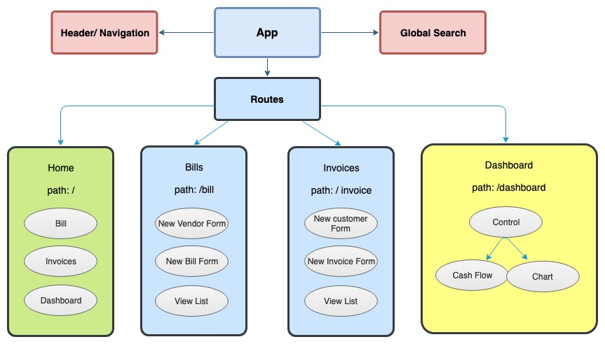
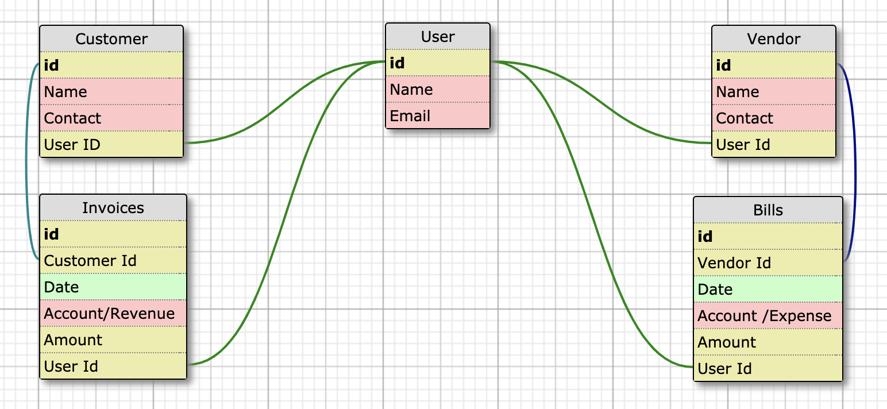
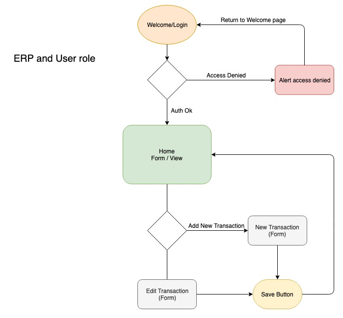

<h3 align="center"> KeepBook </h3>
<h4 align="center"> By Ngan Nguyen </h4>

## Description

_This application allows user to create bills and invoices. It will also have the option to view the cashflow statement ._

## Table of Content

- [Component](#component)
- [Database](#database)
- [User](#user)
- [Features](#Features)
- [Technology](#technology)
- [Research](#research)
- [License](#license)

## Component Tree

# 

## Static Website of Component Tree
* https://github.com/Ngann/KBStatic.git

## Application Component Hierarchy
1. Payable Control
2. Bill Form
3. Bill List
4. Vendor Form
5. Vendor List
6. Receivable Control
7. Customer Form
8. Customer List
9. Invoice Form
10. Invoice List
11. Header
12. Search
13. DashBoard Control

## Database

## Simple Database for User and Transactions

# 

_DB setup per schema_
* https://github.com/Ngann/KeepBook-DB.git

## User

# 

## Features

## Planned Features
* User can add Vendors and Customers
* User can add Bills and Invoices
* User can mark transactions as paid
* User can go to dashboard to see Income and Expense by category, outstanding Bills/Invoices and Bank Account Balances

## Technology
* Javascript
* React
* Materialize / Material UI
* NodeJs
* GraphQL
* Prisma
* AWS Aurora
* Bcrypt
* JWT

## Research
_React, Okta, Sqlite3_
* https://github.com/Ngann/React-Sqlite3.git

_Node, GraphQL , Prism, AWS Aurora_
* https://github.com/Ngann/hackernews-node.git

_FullStack environment setup: Node, React, AWS Aurora_
* https://github.com/Ngann/KeepBook-FS.git

## License
* This project is licensed under the MIT License - see the LICENSE.md file for details
